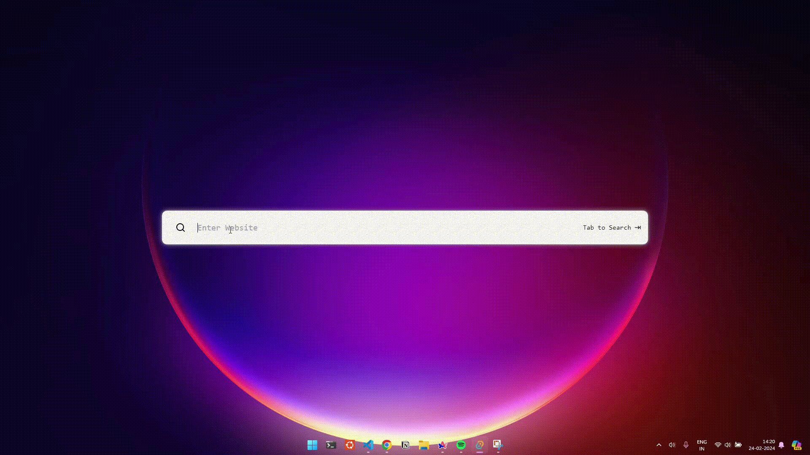

# QUICK SURF 



<!-- vscode-markdown-toc -->
* 1. [📝Prerequisites](#Prerequisites)
	* 1.1. [Installation](#Installation)
* 2. [🚀Quick Start](#QuickStart)
* 3. [🌐Running the Application](#RunningtheApplication)
* 4. [🙌How to Contribute](#HowtoContribute)
* 5. [📖Further Documentsion](#FurtherDocumentsion)
* 6. [🙋Contributor Covenant Code of Conduct](#ContributorCovenantCodeofConduct)

# ✨Features
You can find a list of the latest changes in the [CHANGELOG](/CHANGELOG.md)

##  1. <a name='Prerequisites'></a>📝Prerequisites

Before you begin, ensure you have the following software installed on your machine:

- [Node.js](https://nodejs.org/)
- [npm](https://www.npmjs.com/) (Node.js package manager)

###  1.1. <a name='Installation'></a>Installation

If you don't have Node.js and npm installed, you can download and install them from the official websites:

- **Node.js:** Visit [Node.js official website](https://nodejs.org/) and follow the installation instructions for your operating system.

- **npm:** npm is included with Node.js installation. After installing Node.js, you'll have npm available on your command line.

To verify that Node.js and npm are installed, open a terminal or command prompt and run the following commands:

```bash
node -v
npm -v
```


##  2. <a name='QuickStart'></a>🚀Quick Start


Follow these steps to quickly get started with the project:

1. **Clone the Repository:**

    ```bash
    git clone https://github.com/anipr2002/search-frontend-prototype.git
    ```

2. **Navigate to the Project Directory:**

    ```bash
    cd search-frontend-prototype
    ```

3. **Install Frontend Dependencies:**

    ```bash
    npm install
    ```


##  3. <a name='RunningtheApplication'></a>🌐Running the Application

- **Run Frontend:**

    ```bash
    npm run dev
    ```

    This will start the Frontend development server.


Now you have successfully cloned the repository

> [!TIP]
> Make sure to follow any additional instructions provided in the project documentation for a complete setup.


##  4. <a name='HowtoContribute'></a>🙌How to Contribute

Whenever you encounter a 🐛 bug or have 🎉 feature request, report this via Gitlab issues.

We are happy to receive contributions to VESA in the form of pull requests via Gitlab. Feel free to fork the repository, implement your changes and create a merge request to the develop branch. There is a [forking guide](/CONTRIBUTING.md#forking) available to get you started!

> 💡 **Further info about Contribution**
> Please refer [CONTRIBUTING.md](/CONTRIBUTING.md)

##  5. <a name='FurtherDocumentsion'></a>📖Further Documentsion

An overview about which documentation can be found where. For example the [docs](/docs/) directory

##  6. <a name='ContributorCovenantCodeofConduct'></a>🙋Contributor Covenant Code of Conduct

In the interest of an open and welcoming environment, we as contributors and maintainers pledge to making participation in our project and out community a harrassment-free experience for everyone, regardless of age, body size, disability, ethnicity, sex characteristics, gender identity and expression, level of experience, education, socio-economic status, nationality, personal appearance, race, religion, or sexual identity and orientation.

Read further about the Code of Conduct [here](/CODE_OF_CONDUCT.md).

